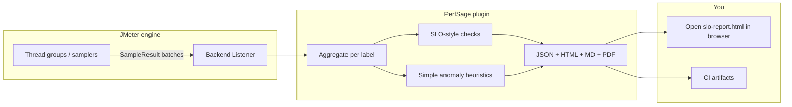
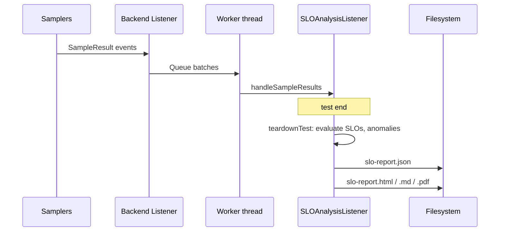

# Architecture: PerfSage SLO Reporter

## Overview

PerfSage SLO Reporter is a JMeter plugin that collects samples during a test run, evaluates them against SLO-style thresholds **when the test ends**, and writes **JSON** plus optional **HTML**, **Markdown**, and **PDF** reports. Statistical “anomaly” notes are computed locally; **hints are bundled text**, not calls to GPT (see [Hints and future LLM](#hints-and-future-llm-byok)).



### Why there is no live UI during `jmeter -n`

Non-GUI mode is headless by design. **SLO aggregation and evaluation run at teardown** (after samples are collected), not as a real-time Swing dashboard. The **HTML report** is the primary visual surface: open `slo-report.html` after the run. In JMeter GUI mode you still configure the Backend Listener like any other element; the “UI” for results remains the generated files (or your CI viewer).

## Implementation status

| Capability | Status | Location / notes |
|------------|--------|------------------|
| Sample collection | Implemented | `SLOAnalysisListener` (`BackendListenerClient`) |
| Per-label percentiles & aggregates | Implemented | Same |
| SLO-style checks (latency p99, synthetic RPS, success rate) | Implemented | Configurable `latencyThresholdMs`, `targetRps`, `successRateTargetPercent` |
| Statistical anomaly notes | Phase 1 | `SimpleAnomalyDetector` (tail latency, errors, spikes) |
| JSON report | Implemented | `SLOAnalysisResult` → `slo-report.json` |
| HTML report (Chart.js) | Implemented | `HtmlReportGenerator` → `slo-report.html` |
| Markdown report | Implemented | `MarkdownReportGenerator` → `slo-report.md` |
| PDF summary | Implemented | `PdfReportGenerator` (Apache PDFBox) → `slo-report.pdf` when enabled |
| Bundled hints (`aiHint` in JSON) | Implemented | `HintCatalog` — **static strings**, not an LLM |
| Optional LLM / BYOK | Not implemented | Future: could replace or augment `HintCatalog` |
| Isolation Forest / NN anomaly (doc v2/v3) | Not implemented | Roadmap only |
| Dedicated Swing config panel | Not implemented | Use standard Backend Listener parameter grid |
| `SLOReporter` JSON-file config path | Partial | Separate class for JSON-config SLOs; primary path is Backend Listener |

Legacy diagrams in older revisions referred to `SLOListener.java`, `ReportGenerator.java` under `slo/`, and `gui/SLOConfigGUI.java`. The **shipping layout** is flatter: `com.perfsage.jmeter` plus `analysis/` and `report/` packages (see tree below).

## Repository layout (actual)

```
src/main/java/com/perfsage/jmeter/
├── SLOAnalysisListener.java      # Backend Listener entrypoint
├── SLOAnalysisResult.java      # JSON DTO + nested metrics / evaluations
├── SLOConfig.java, SLOReporter.java  # JSON-oriented reporter path
├── analysis/
│   └── SimpleAnomalyDetector.java
└── report/
    ├── HintCatalog.java          # Static remediation text
    ├── HtmlReportGenerator.java
    ├── MarkdownReportGenerator.java
    └── PdfReportGenerator.java
```

## Configuration (Backend Listener parameters)

| Parameter | Default | Purpose |
|-----------|---------|---------|
| `outputDir`, `outputFile` | cwd, `slo-report.json` | JSON path; HTML/MD/PDF use same stem |
| `generateHtml` | `true` | Write `*.html` |
| `generateMarkdown` | `true` | Write `*.md` |
| `generatePdf` | `false` | Write `*.pdf` (adds PDFBox to fat JAR) |
| `latencyThresholdMs` | `500` | p99 latency budget per label |
| `successRateTargetPercent` | `99` | Minimum success rate |
| `targetRps` | `100` | Floor for synthetic throughput check |
| `analysisWindowSeconds` | `60` | Divisor for `samples/window` throughput metric |
| `percentileThreshold` | `99` | Logged for future use (p99 used in evaluations today) |

## Hints and future LLM (BYOK)

- JSON field **`aiHint`** is a **misnomer for history**: values come from **`HintCatalog`** only. Root field **`hintSource`** is set to `static_catalog` so consumers know **no external AI API** was called.
- **Other users** need **no API key** today.
- A future **BYOK** (bring-your-own-key) integration could call OpenAI/Azure/etc. from `HintCatalog` or a sibling class; that would be **opt-in**, configured explicitly, and would not be required for core SLO reporting.

## Data flow (runtime)



## Maven / JMeter dependencies

JMeter artifacts remain `provided`; **Jackson** and **PDFBox** are bundled in the `*-all.jar` fat artifact for command-line use.

## Performance notes

- Listener uses **per-label lists** of latencies for percentiles; very long tests with huge cardinality may need future streaming approximations (see roadmap).
- Target: keep plugin overhead low vs. sampler time; not formally benchmarked in CI yet.

## Roadmap (not yet in code)

- OpenTelemetry export, Grafana templates, baseline comparison, GitHub Action templates
- Richer anomaly models (IQR/Z-score tuning, optional ML libraries)
- Optional LLM hints with explicit BYOK configuration
